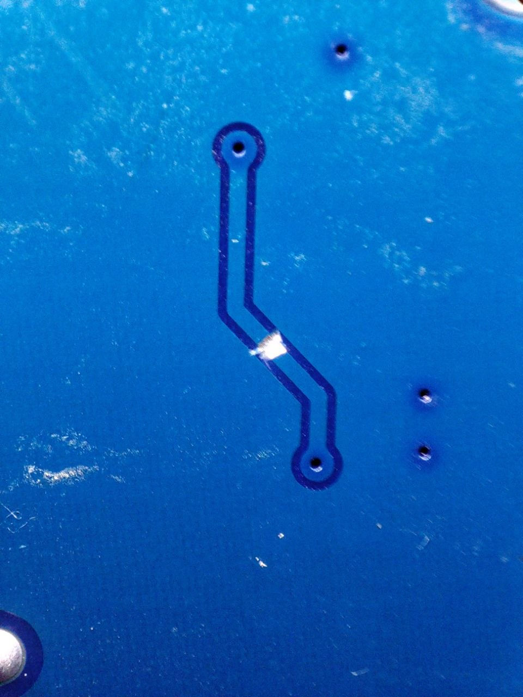
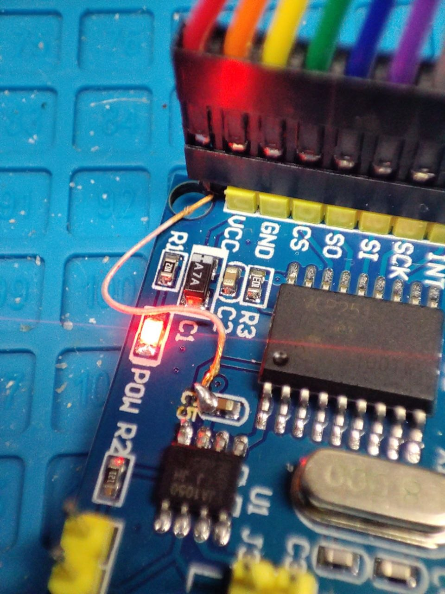
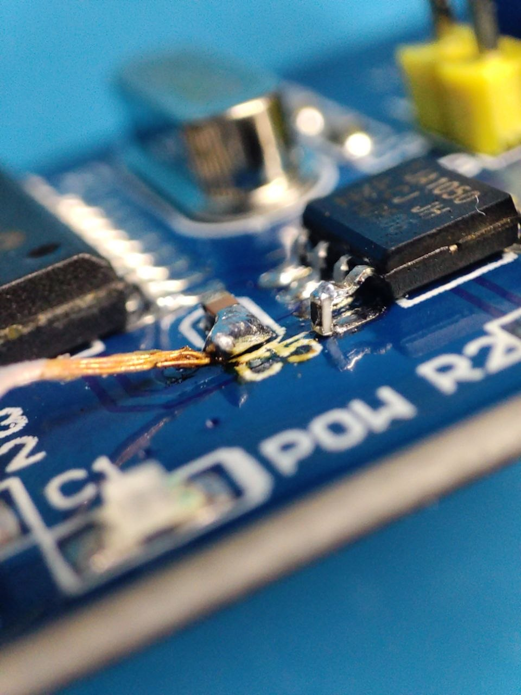
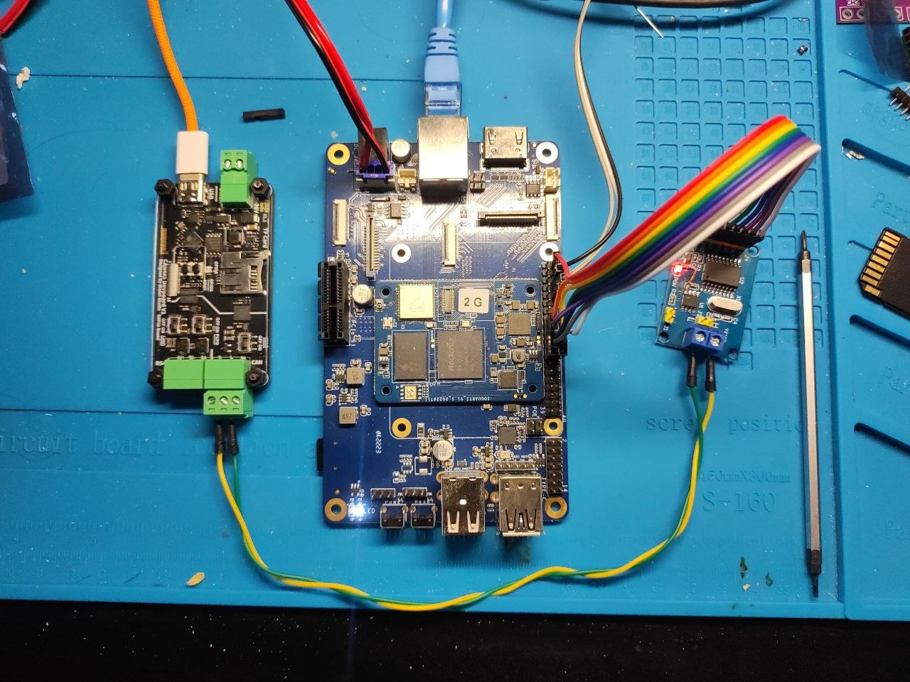

# FreeBSD SocketCAN on the Pine64 SOQuartz (RK3566)

A reproducible build of a **bootable FreeBSD 16-CURRENT/arm64 image** for the
Pine64 **SOQuartz** compute module (RK3566) on the **Model A** carrier, with a
Linux-compatible **SocketCAN (`PF_CAN` / `netcan`)** stack and **two ways to put
real CAN frames on the wire**:

- **Scenario A — MCP2515**: a Microchip MCP2515 classic-CAN controller on SPI,
  driven by an in-kernel `mcp2515(4)` driver → a `can0` interface. If you have
  a Microchip **MCP2517FD/MCP2518FD** (CAN FD) module instead, the same wiring
  works with the `mcp251xfd(4)` driver — see section 4.1.
- **Scenario B — slcan bridge**: a serial/TCP SLCAN (Lawicel) adapter bridged
  into a `slcanN` interface by the `slcand` daemon. Reference adapter firmware:
  [espcan_br](https://github.com/cleverfox/espcan_br) for the WeAct CAN485
  ESP32 board.

Both expose standard `AF_CAN` `SOCK_RAW` sockets, so `can-utils`
(`candump`/`cansend`), `tcpdump`, and your own software work unmodified.

---

## Source code

- **FreeBSD tree:** <https://github.com/cleverfox/freebsd-src> branch **`canbus`**
  — the `netcan` PF_CAN stack, `slcand`, the `mcp2515(4)` driver, and the
  `rk_spi` interrupt-relay fix are all committed there.
- **Two device-tree changes** are *not* in the branch yet and live in
  `patches/`: one required (the SOQuartz DTB build entry), one optional
  (the SD `vmmc` fix — see section 1).
- **This repo** carries the build tooling, device-tree overlays, the U-Boot
  port, and these docs.

```
patches/    device-tree patches to apply on top of the canbus branch
scripts/    U-Boot + image build scripts (run on the build host)
overlays/   device-tree overlays (MCP2515 driver / spigen tool)
release/    release(7) board config (SOQUARTZ.conf), upstreaming reference
ports/      FreeBSD ports: u-boot-soquartz-model-a, can-utils (upstream + netcan patch)
tools/      mcp2515 spigen userspace bring-up tool
photos/     wiring / board-modification photos
```

---

## 1. Build host

FreeBSD doesn't cross-build from non-FreeBSD hosts, so you need a **FreeBSD/amd64
builder** (it cross-compiles to arm64). ~16 cores / 50+ GB free is comfortable.
You need passwordless `sudo`.

Install the U-Boot toolchain and image tools as **binary packages** (building
the cross-toolchain from ports hits a `texinfo`/`perl5` issue):

```sh
sudo pkg install -y aarch64-none-elf-gcc gsed rkbin bison flex gawk \
    gmake pkgconf python3 swig dtc py311-pyelftools py311-setuptools \
    gnutls zstd
```
(`py311-setuptools` is needed by U-Boot's pylibfdt build, `gnutls` by its
`mkeficapsule` tool.) A native **arm64** FreeBSD builder works too, with the
exact same commands.
(`makefs`, `mkimg`, `gpart`, `mdconfig`, `newfs_msdos` are in the base system.)

### Get the sources on the build host
```sh
# FreeBSD tree + patches
git clone -b canbus https://github.com/cleverfox/freebsd-src.git ~/src
cd ~/src
git apply /path/to/this-repo/patches/0002-build-soquartz-model-a-dtb.patch
# optional -- only if U-Boot can't power your microSD (see note below):
#git apply /path/to/this-repo/patches/0001-soquartz-model-a-sd-vmmc-supply.patch

# U-Boot 2025.04 source for the SOQuartz bootloader build
fetch -o /tmp/u-boot-2025.04.tar.bz2 https://ftp.denx.de/pub/u-boot/u-boot-2025.04.tar.bz2
tar xf /tmp/u-boot-2025.04.tar.bz2 -C ~/ && mv ~/u-boot-2025.04 ~/ubuild

# this repo (scripts expect to be run from its checkout)
git clone https://github.com/cleverfox/freebsd_canbus.git ~/soquartz-can   # any path; run scripts from here
```

> Patch `0002` is required: the SOQuartz Model A DTB isn't in the kernel's DTB
> build list, so without it no `rk3566-soquartz-model-a.dtb` gets built.
>
> Patch `0001` is **optional**: the SOQuartz microSD `vmmc-supply` points at a
> *disabled* regulator, which *can* leave U-Boot unable to power the card
> ("did not respond to voltage select! : -110"). In practice a healthy card
> boots fine without the patch (verified end-to-end) — the -110 symptom we
> chased turned out to be a **marginal card**. Try a good card first; apply
> `0001` only if the symptom persists.

---

## 2. Build the image

One command does U-Boot → kernel+modules → rootfs → image → checksum:

```sh
# first time only: build world (≈30–60 min)
cd ~/src && env MAKEOBJDIRPREFIX=$HOME/obj __MAKE_CONF=/dev/null SRCCONF=/dev/null \
    make -j$(sysctl -n hw.ncpu) TARGET=arm64 TARGET_ARCH=aarch64 buildworld

# build everything else + assemble the image
sh ~/soquartz-can/scripts/build-image-complete.sh

# ... or, if your CAN module is an MCP2518FD (CAN FD) instead of an MCP2515:
env CAN_DRIVER=mcp251xfd \
    MCP2515_OVERLAY=~/soquartz-can/overlays/rk3566-soquartz-mcp2518fd-can.dtso \
    sh ~/soquartz-can/scripts/build-image-complete.sh
```

Output: `~/soquartz-freebsd-arm64.img` (+ `.img.zst` and `.sha256`).

The image contains: a stock **GENERIC** kernel (with the `rk_spi` interrupt-relay
fix), `can.ko` + `mcp2515.ko`, the SOQuartz Model A DTB, the **MCP2515 CAN
overlay** enabled in `loader.conf`, `slcand`, the `mcp2515` spigen tool, and a
**passwordless root**. U-Boot is built from the mainline
`soquartz-model-a` defconfig (the prebuilt `u-boot-quartz64-a` package bootloops
on this board).

What the scripts do (see `scripts/` for details):
- `build-uboot.sh` — builds `idbloader.img` + `u-boot.itb` from `~/ubuild` with
  the rkbin TF-A BL31 + RK3566 DDR blob.
- `mk-image.sh` — `installworld`/`installkernel` → `~/rootfs`, writes
  `fstab`/`loader.conf`/`rc.conf`, makes root passwordless, cross-builds the
  spigen tool, compiles the CAN overlay into `/boot/dtb/overlays`, `makefs` the
  UFS, lays out the GPT with `gpart`, and `dd`s U-Boot into the reserved gap.

---

## 3. Flash and first boot

```sh
zstd -d soquartz-freebsd-arm64.img.zst
# pick the right device! (macOS: /dev/rdiskN after `diskutil list`)
sudo dd if=soquartz-freebsd-arm64.img of=/dev/diskN bs=4m
```
- Use a **good-quality** microSD. A marginal card shows up as a U-Boot
  `Card did not respond to voltage select! : -110` and a hang at the loader.
- Console: 3.3 V USB-serial on the debug UART, **1500000 8N1** available on
  40-pin header: 6-GND, 8-TX (out), 10-RX (in).
- It **autoboots** (no manual U-Boot interaction) and you log in as **`root`
  with an empty password** (just Enter). Set one with `passwd`.
- DHCP + sshd are on. To grow the rootfs to the card: it auto-`growfs`es; if the
  GPT secondary header warning bothers you, `gpart recover mmcsd0`.

Sanity check the CAN stack (no hardware needed):
```sh
kldstat | grep can
ifconfig vcan0 create up           # virtual CAN loopback
```

---

## 4. Scenario A — MCP2515 (in-kernel SPI driver → `can0`)

### Board modification (REQUIRED)
The common AliExpress "MCP2515 CAN module" carries an **MCP2515** controller and a
**TJA1050** transceiver sharing **one 5 V rail**. The TJA1050 is **5 V-only**
(4.75–5.25 V), but the MCP2515 must run at **3.3 V** here so its SPI/INT lines are
safe for the SOQuartz's 3.3 V GPIO (5 V exceeds the SoC I/O abs-max). Two changes
are needed.

**1) Split the power rails** — MCP2515 @ 3.3 V, TJA1050 @ 5 V:
1. On the **bottom** of the PCB there is a single track — the **TJA1050 power
   supply**. **Cut it** to isolate the TJA1050 VCC from the shared rail.
2. Feed **5 V** directly to the **TJA1050 power capacitor** (red wire).
3. Power the module VCC pin — now feeding only the **MCP2515** — from **3.3 V**
   (orange wire).




**2) Current-limit the transceiver's receive output.** TJA1050 **pin 4** (its
data output to the controller — RXD) swings **0–5 V**, but it drives the
MCP2515 **RXCAN** input, which now runs at 3.3 V; 5 V exceeds its abs-max. Put a
**100 Ω** resistor in series on that line to limit current into the MCP2515's
input clamp. One way (used here): desolder TJA1050 **pin 4**, bend it up, and
mount a vertical **0402 100 Ω** between the track and the pin. Alternatively,
**cut the track and solder the resistor across the cut**.



Result: MCP2515 @ 3.3 V (logic-compatible with the SOQuartz), TJA1050 @ 5 V (bus),
and the one 5 V→3.3 V signal current-limited. (More background in
`tools/mcp2515/README.md`.)

**Alternative 1 — swap in a 3.3 V transceiver (simplest).** Instead of both
changes above, replace the 5 V TJA1050 with a **3.3 V** CAN transceiver — the TI
**SN65HVD230** is pin-compatible (same SO8 footprint: D/GND/VCC/R/Vref/CANL/CANH/
RS). Desolder the TJA1050 and fit the SN65HVD230 in its place; the whole module
then runs from the single **3.3 V** rail (controller + transceiver), so there's
**no track to cut, no 5 V rail, and no series resistor** — every logic line is
3.3 V end to end. (SN65HVD230 breakout modules are also sold standalone if you'd
rather keep the controller and transceiver as separate boards.)

**Alternative 2 — level-shift SPI/INT, leave the board at 5 V (no board mod).**
Power the **unmodified** module entirely from **5 V** (MCP2515 + TJA1050 both at
5 V), and put a **TXS0108E** 8-bit bidirectional level translator between it and
the SOQuartz:
- **VccA = 3.3 V** (SOQuartz side, the low-voltage bus), **VccB = 5 V** (module
  side, the high-voltage bus). This **A = low / B = high** orientation is
  mandatory — wiring it backwards won't translate correctly.
- Route the five digital lines through it — **SCK, MOSI, MISO, CS, INT** —
  A-side to the SOQuartz GPIO (pins in the table above), B-side to the matching
  MCP2515-module pins. (CANH/CANL are unaffected — analog bus side.)
- Tie **OE** high (to VccA via a pull-up) to enable the outputs; common **GND**
  for both sides.

The TXS0108E auto-senses direction per channel, so it handles the mixed SPI
directions (SCK/MOSI/CS out, MISO/INT in) without strapping. Keep the SPI clock
moderate — its auto-direction is happiest with push-pull SPI at a few MHz; if you
see SPI glitches, lower `spi-max-frequency` in the overlay (the MCP2515 tops out
at 10 MHz, and CAN bitrate is independent of SPI clock).

### Wiring (SOQuartz Model A 40-pin header, SPI3 "M0" pins)
The stock module carries an **8 MHz** crystal; **500 kbit/s is the 8 MHz
ceiling** (1 Mbit/s needs ≥5 TQ/bit, and 8 MHz yields only 4 — no valid
timing exists).

**Optional crystal upgrade — 1 Mbit/s.** Replace the module's 8 MHz quartz
with a **16 MHz** or **24 MHz** one and change the overlay to match —
`clock-frequency = <16000000>` (or `<24000000>`) in
`overlays/rk3566-soquartz-mcp2515-can.dtso` (rebuild the `.dtbo`, see the
overlay header). The driver picks the bit-timing table from the FDT
`clock-frequency`, so the full range up to **1 Mbit/s** (the classic-CAN
maximum) becomes available. Both crystals are verified working on this setup.

| MCP2515 module | SOQuartz (MB pin) | function |
|---|---|---|
| SCK | GPIO4_B3 (23) | spi3 clk |
| SI  | GPIO4_B2 (19)| spi3 mosi |
| SO  | GPIO4_B0 (21) | spi3 miso |
| CS  | GPIO4_A6 (24) | spi3 cs0 |
| INT | GPIO4_B1 (22) | GPIO interrupt (level-low) |
| VCC (MCP2515) | **3.3 V** (17 - orange wire on photos) | controller power |
| TJA1050 cap | **5 V** (2 - red wire on photos) | transceiver power (post-mod) |
| GND | GND (20) | common ground |

Full bench setup — SOQuartz on its baseboard, the modified MCP2515 board, 3.3 V
(orange) to the MCP2515 and 5 V (red) to the TJA1050, and a second CAN node on a
**WeAct CAN485 ESP32** (running [espcan_br](https://github.com/cleverfox/espcan_br),
Scenario B):



### It's already enabled
The image ships `mcp2515_load="YES"` and
`fdt_overlays="rk3566-soquartz-mcp2515-can.dtbo"` in `/boot/loader.conf`, so on
boot the driver attaches and you get `can0`:
```sh
dmesg | grep -i mcp2515            # "<can0> ... 8 MHz xtal, default 500 kbit/s"
ifconfig can0
```
If no chip is wired, the driver simply logs "MCP2515 not responding" and `can0`
is absent — no panic.

### Configure the bitrate (live)
```sh
sysctl dev.mcp2515.0.bitrate=125   # 100 | 125 | 250 | 500 (8 MHz crystal)
                                   # with the 16/24 MHz crystal mod: up to 1000
```
It reprograms the controller immediately (cycles config→normal). Persist across
reboots in `/etc/sysctl.conf`:
```
dev.mcp2515.0.bitrate=125
```
**Both ends of the bus must use the same bitrate.**

### Bring it up and test
```sh
ifconfig can0 up
# can-utils isn't a FreeBSD package -- build it from ports/can-utils first
candump can0 &
cansend can0 123#DEADBEEF          # needs ≥1 other node on the bus to ACK
```

---

## 4.1 Scenario A variant — MCP2518FD (CAN FD → `can0`)

If your SPI module carries a Microchip **MCP2517FD/MCP2518FD** instead of an
MCP2515, use the in-kernel **`mcp251xfd(4)`** driver (also in the `canbus`
branch; `mcp251xfd.ko` ships in the image) with the
`overlays/rk3566-soquartz-mcp2518fd-can.dtso` overlay. You get CAN FD on top
of classic CAN.

- **Wiring is identical** to the MCP2515 table in section 4 (SPI3 "M0" pins,
  INT on GPIO4_B1). The same 3.3 V logic rules apply: the MCP251xFD runs
  happily at 3.3 V, so power the controller at 3.3 V and treat a 5 V-only
  transceiver exactly as described in section 4.
- **Crystal**: the overlay assumes the usual **40 MHz** module crystal
  (`clock-frequency = <40000000>`); edit it to match your board. With 40 MHz
  the full classic range plus CAN FD data rates are available — no crystal
  ceiling like the MCP2515's 8 MHz part.

**Build the image for it** (instead of the default MCP2515 one, section 2):
```sh
env CAN_DRIVER=mcp251xfd \
    MCP2515_OVERLAY=~/soquartz-can/overlays/rk3566-soquartz-mcp2518fd-can.dtso \
    sh ~/soquartz-can/scripts/build-image-complete.sh
```

**Or switch an already-flashed MCP2515 image over, on the board:**
```sh
dtc -@ -I dts -O dtb -o /boot/dtb/overlays/rk3566-soquartz-mcp2518fd-can.dtbo \
    rk3566-soquartz-mcp2518fd-can.dtso
# /boot/loader.conf: replace the mcp2515 lines with
#   mcp251xfd_load="YES"
#   fdt_overlays="rk3566-soquartz-mcp2518fd-can.dtbo"
```
Never list both overlays in `fdt_overlays` (mcp2515, mcp2518fd, and the spigen
overlay all claim SPI3 CS0).

**Bitrate / CAN FD.** The driver comes up in classic-CAN mode at 500 kbit/s;
`cansend`/`candump` work as in section 4. Rates are sysctls:
```sh
sysctl dev.mcp251xfd.0.bitrate=500     # arbitration/classic bitrate (kbit/s)
sysctl dev.mcp251xfd.0.dbitrate=2000   # CAN FD data-phase bitrate (kbit/s)
ifconfig can0 mtu 72 up                # MTU 72 = CANFD_MTU -> enables FD frames
```
Both ends of the bus must agree on the bitrates (and FD-capability) as usual.

---

## 5. Scenario B — slcan bridge (serial / TCP → `slcanN`)

FreeBSD has no `N_SLCAN` line discipline, so `slcand` (in the canbus branch,
installed in the image) bridges an SLCAN/Lawicel adapter into a `slcanN`
interface, in userspace:

```
adapter (serial SLCAN | TCP) <-> slcand <-> /dev/slcanN <-> AF_CAN sockets
```

The reference adapter is the **WeAct CAN485 DevBoard V1 (classic ESP32)** running
[**espcan_br**](https://github.com/cleverfox/espcan_br) — a `no_std` async Rust
SLCAN bridge. It exposes the CAN bus as an SLCAN adapter over **two transports at
once**: the **USB-serial port (UART0, 115200 8N1)** and a **TCP server on port
2000** over WiFi; it can also **dial out** as a TCP client. Each transport (and
each TCP connection) is an independent SLCAN port with its own `O`/`C`. Build and
flash per the espcan_br repo, then configure WiFi (below) and bridge it on the
FreeBSD side.

> WiFi setup: with no saved credentials the board boots a config AP `espcan-br`
> (192.168.4.1) with an HTTP setup page — enter SSID/password, it reboots and
> joins your network (its station IP is shown on the page; it also advertises
> itself over mDNS as `espcan-br`, and the UART baud is configurable there). The
> SLCAN TCP server (:2000) runs on both the AP and the station IP. For an
> outbound (NAT-friendly) client connection, set a `tcp://host:port/` URL on that
> page.

`slcand` usage (FreeBSD, from the canbus branch):
```
serial:      slcand [opts] <serialdev> [ifname]
TCP server:  slcand [opts] -p <port>      [ifname]   # listen; adapter dials in
TCP client:  slcand [opts] -t <host:port> [ifname]   # connect to the adapter
  -o          send "open channel" (O) to the adapter
  -c          send "close channel" (C) on exit
  -s <0-8>    CAN bitrate code: S0=10k S1=20k S2=50k S3=100k S4=125k
                                S5=250k S6=500k S7=800k S8=1M
  -b <baud>   serial UART baud (default 115200 = the board's UART0 rate)
  -v          print bridged frames (candump-like)
  [ifname]    interface to create (default slcan0)
```
Bitrate must match both ends; the firmware supports **S2–S8** (S0/S1 unsupported
on the classic ESP32) and defaults to **S6 (500 kbit)** if unset.

### B1 — Serial (USB-UART)
The board's USB-serial ↔ a FreeBSD host (`/dev/cuaU0`; default 115200 matches the
firmware). Open the channel at 125 kbit/s and create `slcan0`:
```sh
slcand -o -c -s4 /dev/cuaU0 slcan0     # -s4 = 125 kbit/s
ifconfig slcan0 up
candump slcan0
```

### B2 — TCP, board as server (port 2000)
The firmware listens on **:2000**; point `slcand` at it as a client:
```sh
slcand -o -c -s4 -t <board-station-ip>:2000 slcan0
ifconfig slcan0 up
```

### B3 — TCP, board dials out (client / behind NAT)
Run `slcand` as a **server** on a reachable FreeBSD host, then set the board's
auto-connect URL (web page) to `tcp://<that-host-ip>:<port>/`:
```sh
slcand -o -c -s4 -p 9000 slcan0        # FreeBSD listens; board connects out
ifconfig slcan0 up
```

> `slcand`'s TCP modes also tunnel a CAN bus **between two FreeBSD machines** (the
> SLCAN wire format is identical on serial and TCP): one `-p` server, one `-t`
> client, and the two `slcanN` interfaces share a virtual bus.

### Enable at boot
`rc.conf` has a commented template; for a serial adapter:
```
slcand_enable="YES"
slcand_flags="-o -s4 /dev/cuaU0"
```

---

## 6. Testing CAN (both scenarios)

`can-utils` is **not a FreeBSD package** — build it from this repo's
`ports/can-utils/` (upstream `linux-can/can-utils` + a netcan patch, no fork;
see that dir's README):
```sh
pkg install -y libepoll-shim
cp -R ports/can-utils /usr/ports/comms/can-utils
cd /usr/ports/comms/can-utils && make makesum && make install clean
```
Then:
```sh
candump -tz can0                 # timestamped dump (or slcan0)
cansend can0 5A1#1122334455667788
tcpdump -ni can0                 # BPF also works on CAN interfaces (no build needed)
```
- A classic CAN frame needs an **ACK from ≥1 other node**; a lone transmitter
  will retry/flag errors (`ifconfig`/`netstat` counters, MCP2515 `regdump`).
- For a quick TX↔RX check without a bus, use `vcan` or the MCP2515 spigen
  `selftest` (internal loopback).
- Cross-test the two scenarios against each other: an MCP2515 `can0` on one
  board and an slcan `slcan0` (ESP485) on another, on the same physical bus, at
  the same bitrate.

---

## 7. What's in the `canbus` branch (the changes)

The FreeBSD-side work, for reference / upstreaming:
- **`netcan`** — the `PF_CAN`/`AF_CAN` family: `CAN_RAW` sockets, `can_input`/
  `can_if_output`, `vcan`/`cantap`, BPF (`DLT_CAN_SOCKETCAN`).
- **`usr.sbin/slcand`** — the serial/TCP SLCAN bridge daemon + rc.d service.
- **`sys/dev/mcp2515/if_mcp2515.c`** — the MCP2515 driver (classic CAN).
- **`sys/dev/mcp251xfd/`** — the MCP2517FD/MCP2518FD driver (CAN FD).
- **`rk_spi` fix** — added bus resource-relay methods so an SPI child can
  allocate its FDT GPIO interrupt (needed by any IRQ-driven SPI device on
  Rockchip, not just CAN).
- Build wiring for the CAN module + headers; ATF tests for `CAN_RAW`.

Plus the two device-tree patches in `patches/` (the required SOQuartz DTB
build entry + the optional SD `vmmc` fix, see section 1), the
`release/arm64/SOQUARTZ.conf` board config, and the
`sysutils/u-boot-soquartz-model-a` port.

---

## 8. Known issues / TODO

- bitrate via sysctl (no netlink bit-timing / bus-off restart yet)
